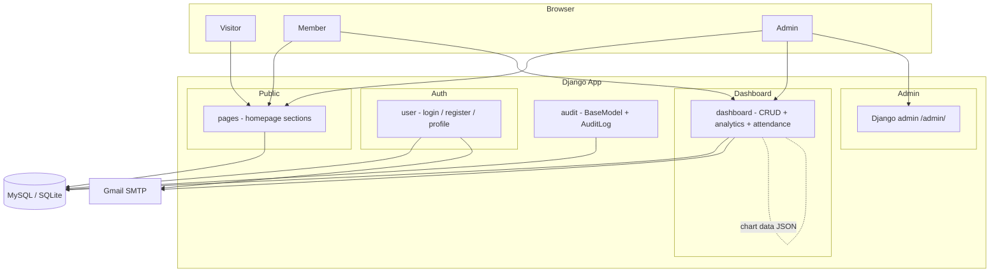
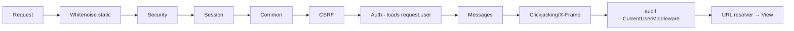
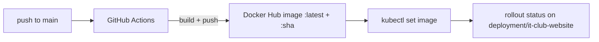

# 1 · Architecture

## Purpose

The IT Club Website is a Django content-management system that lets a club
publish a homepage and run a small "membership CRM". A non-technical admin can
change the site's content and layout from a dashboard; the public only sees
what admins choose to display.

Two distinct audiences use the system:

| Persona | Sees | Can do |
|---|---|---|
| **Visitor** | Public homepage | Browse club info, activities, projects, resources |
| **Member** | Public homepage + dashboard | View events/sessions, "My Projects", own attendance |
| **Admin** | Everything | Manage content, members, attendance, audit log, site layout |

## High-level component view

## Tech stack

- Python 3.14, Django 5.2.9
- SQLite (local default) / MySQL 8.0 (Docker, prod)
- Whitenoise (manifest static serving — `collectstatic` required in prod)
- PyMySQL (MySQL driver — installed via `config/__init__.py`, do **not** add `mysqlclient`)
- Pillow (image fields), Gunicorn (production WSGI)
- Tailwind CDN + Swiper + AOS (public site), Chart.js (dashboard)
- Docker Compose (web + db)
- GitHub Actions → Docker Hub → Kubernetes

No Celery or Redis — they were removed (see
[`celery-redis-removal.md`](celery-redis-removal.md)).

## Django apps

Each Django app owns one concern. All content models inherit
`audit.models.BaseModel`.

| App | Responsibility | Key models |
|---|---|---|
| `config` | Project settings, root URLs, WSGI/ASGI, MySQL shim | — |
| `audit` | Abstract `BaseModel`, `AuditLog`, thread-local current-user middleware | `AuditLog` |
| `user` | Custom email-based `User`, login/register/profile/password-reset, group mixins, email sender | `User` |
| `pages` | Public homepage + site-wide config + section content | `PageSettings`, `AboutUs`, `WhatWeDo` |
| `projects` | Club project showcase | `Project` |
| `events` | Event showcase | `Event` |
| `resources` | Learning-material showcase (files/links) | `Resource` |
| `attendance` | Meeting/session attendance | `Session` |
| `dashboard` | Member dashboard: CRUD for everything, analytics, attendance views | (no own models — drives the others) |

## URL map

Root URLconf lives in `config/urls.py`:

| Prefix | App | Notes |
|---|---|---|
| `/` | `pages` | `""` → `IndexView` (homepage); `/events/`, `/resource/` → public landing pages |
| `/accounts/` | `user` | login, logout, register, `/me/` profile, `/users/`, password-reset suite |
| `/dashboard/` | `dashboard` | analytics, page/about settings, members, what-we-do, events, projects, resources, sessions, attendance, audit |
| `/admin/` | Django admin | built-in superuser admin |
| `/media/` | — | only mounted in `DEBUG` |

The dashboard's full route table is in `dashboard/urls.py`; the user routes in
`user/urls.py`; the public routes in `pages/urls.py`.

## Request pipeline

Ordered middleware (`config/settings.py`):

The last middleware (`audit/middleware/current_user.py`) stashes
`request.user` in thread-locals so `BaseModel.save()` can attribute audit log
entries without every caller passing the user explicitly.

Every template render additionally receives:

- `page_settings` — the cached singleton `PageSettings` (1h LocMemCache), via
  `pages/context_processors.py`;
- `is_admin` / `is_member` — booleans derived from the user's `Group`
  membership, via `user/context_processors.py`.

## Settings decisions (summary)

Full details and rationale live in [`03-logical-decisions.md`](03-logical-decisions.md).

- `.env` loaded via `python-dotenv`; all secrets come from env vars.
- `DATABASE_MODE=mysql|sqlite` selects the DB backend at import time.
- `AUTH_USER_MODEL = "user.User"`; `LOGIN_URL = "user:login"`.
- Email via Gmail SMTP (TLS, port 587); `EMAIL_HOST_USER/PASSWORD` from env.
- `STATICFILES_STORAGE = whitenoise.storage.CompressedManifestStaticFilesStorage`.

## Deployment

Two ways the system runs:

1. **Local / Docker Compose** (`docker-compose.yml`) — services `web`
   (entrypoint) and `db` (MySQL 8, healthcheck).
2. **Production (Kubernetes)** — pushed automatically on every merge to
   `main`:

`entrypoint.sh` (runs inside the `web` container) bootstraps the app:

1. `collectstatic --noinput` (needed by Whitenoise manifest storage)
2. `migrate --noinput`
3. `add_groups` (idempotently creates `Admin` and `Member` groups)
4. `runserver` when `DEBUG=TRUE`, otherwise **Gunicorn** on `:8000`

Work happens on feature branches (`feat/…`, `fix/…`) merged via PR; a `prod`
branch also exists alongside `main`.
