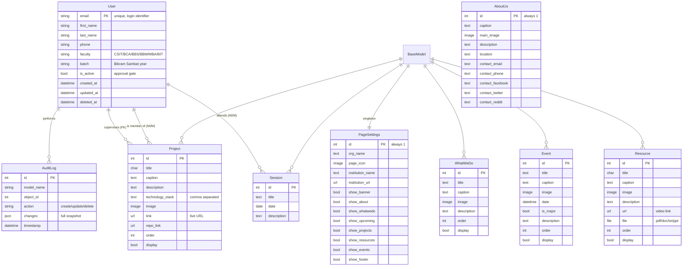

# 2 · Data Model

## Overview

There are **9 models** spread across 7 apps. Every content model inherits the
abstract `audit.models.BaseModel`, which gives every table three extra columns
(`created_at`, `updated_at`, `deleted_at`), soft-delete behavior, and automatic
audit logging. The only exceptions are `AuditLog` itself (it must never be
audited or deleted) and `Group` (built into Django's `auth` app).

## Entity-relationship diagram

## BaseModel — the shared foundation (`audit/models.py`)

Every content model adds these fields automatically:

| Field | Purpose |
|---|---|
| `created_at` | set once on insert (`auto_now_add`) |
| `updated_at` | rewritten on every save (`auto_now`) |
| `deleted_at` | `NULL` while live; timestamp once soft-deleted |

Two managers:

- `objects` — `ActiveManager`; **excludes** soft-deleted rows. This is the
  default, so normal queries never see deleted records.
- `objects_all` — the plain manager; returns everything (used by admin/audit).

Behavior:

- `save()` writes the row, then creates an `AuditLog` row (`create` vs `update`)
  with a **JSON snapshot** of every field (FKs as `"[pk]label"`, M2M as lists).
  Pass `no_audit=True` to skip the log (used internally by `delete()`).
- `delete()` does **not** remove the row — it sets `deleted_at = now` and
  records an `AuditLog` with action `delete`.
- The audit entry's `user` is resolved automatically from thread-locals
  (set by `CurrentUserMiddleware`), falling back to the model itself or its
  `user`/`user_id` if it is user-like.

`Meta.ordering` defaults to `-updated_at`.

> **Important:** `User` extends `BaseModel` too, but overrides the manager with
> `UserManager`, which also filters `deleted_at IS NULL`. Deleting a user only
> soft-deletes them, keeping their attendance/project links valid.

## Model-by-model notes

### `User` (`user/models.py`)

- Extends Django's `AbstractUser` but sets `username = None` — **email is the
  login identifier** (`USERNAME_FIELD = "email"`, unique).
- Extra profile fields: `faculty`, `batch`, `phone`, `interested_topics`.
- `is_active` doubles as the **registration approval gate**: new registrations
  are created `is_active=False` and cannot log in until an admin activates them.
- `batch` uses **Bikram Sambat (Nepali) years**, generated from `2068` up to
  the current Gregorian year `+ 57` (see `03-logical-decisions.md`).
- Convenience properties: `full_name`, `is_admin_group`.
- `create_superuser` auto-joins the `"Admin"` group.

### `AuditLog` (`audit/models.py`)

A plain (non-audited) model storing `model_name`, `object_id`, `action`
(`create`/`update`/`delete`), an optional JSON `changes` snapshot and the
performing `user`. This is the raw feed shown in the dashboard audit log.

### `PageSettings` (`pages/models.py`) — singleton

One row (forced `pk = 1`) holding club identity (`org_name`, `page_icon`,
`institution_name/url`) and the **section-visibility flags** (`show_banner`,
`show_about`, `show_whatwedo`, `show_upcoming`, `show_projects`,
`show_resources`, `show_events`, `show_footer`). Cached in memory for 1 hour;
the cache is purged on save.

### `AboutUs` (`pages/models.py`) — singleton

One row (`pk = 1`) with club story, image, location and contact links. Used on
the homepage banner/about sections and to decorate the login/register pages.

### `WhatWeDo` (`pages/models.py`)

Activity cards for the "What We Do" slider. `order` controls sort position;
`display` toggles visibility independently of the section flag.

### `Event` (`events/models.py`)

`date` (datetime), `is_major` flag (major events get their own homepage
slider), plus `order`/`display`.

### `Project` (`projects/models.py`)

Showcase project with `technology_stack` (comma-separated text, split into a
tag list in the dashboard detail view), `link`, `repo_link`, `supervisor` (FK →
`User`) and `members` (M2M → `User`). The M2M + supervisor drive ownership
permissions and the "My Projects" view.

### `Resource` (`resources/models.py`)

Learning material with either a `url` (video) and/or an uploaded `file`,
restricted by `FileExtensionValidator` to `pdf, doc, docx, txt, ppt, pptx`.

### `Session` (`attendance/models.py`)

A club session/meeting on a `date` with an M2M `attendees` → `User`
(`related_name="attended_sessions"`). This M2M is the source of truth for all
attendance metrics and the dashboard's engagement analytics.

## Relationship summary

| From | To | Kind | Meaning |
|---|---|---|---|
| `User` | `AuditLog` | 1→N | who performed the change |
| `User` | `Project` | 1→N (FK `supervisor`) | project supervisor |
| `User` | `Project` | M→N (`members`) | project team members |
| `User` | `Session` | M→N (`attendees`) | who attended which session |
| `Session` | `User` | M→N (`attended_sessions` reverse) | attendance lookup per member |

No other foreign keys exist; the content models are deliberately independent
so sections can be shown/hidden and re-ordered in isolation.
