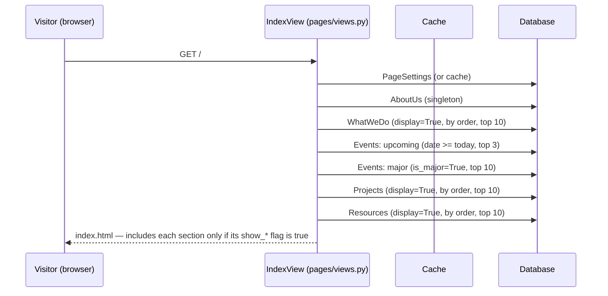
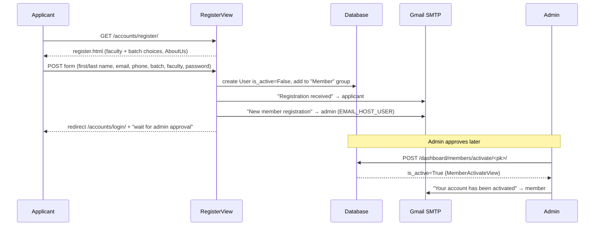
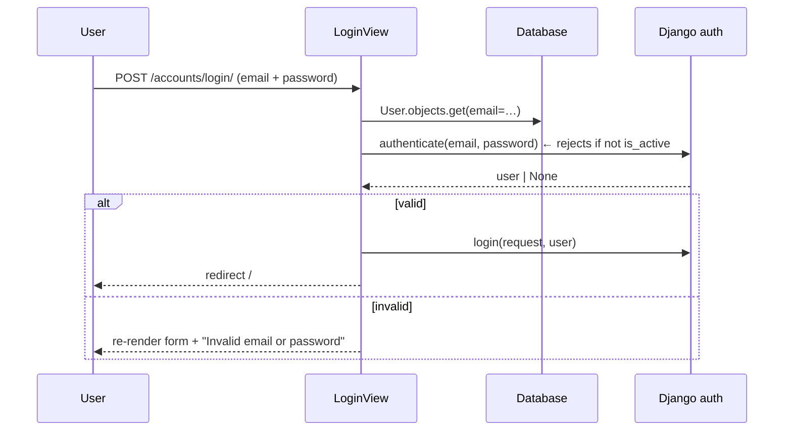
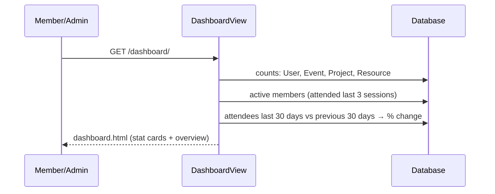
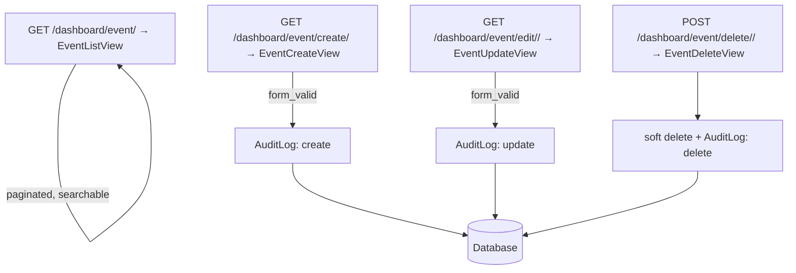
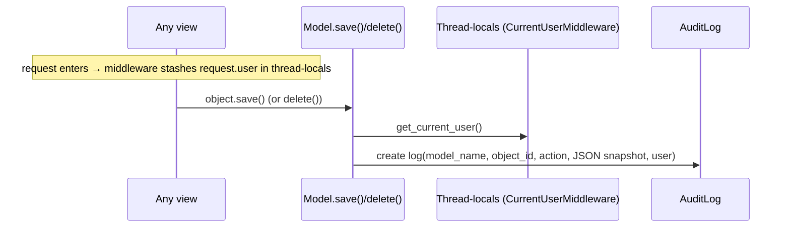
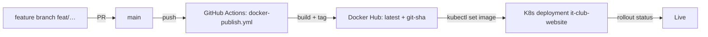

# 4 · Data Flow

This page walks through the system's end-to-end flows, from a visitor hitting
the homepage to a code change reaching production. Every write through a
`BaseModel` also fans out to the audit trail described in section 6.

---

## 1. Public homepage



- The navbar title/icon come from the cached `page_settings` context
  processor; the navbar shows *Dashboard* + *Logout* for authenticated
  members/admins, otherwise *Login*.
- Section templates render whatever subset the admin chose; e.g. the "Upcoming
  Activities" grid iterates `upcomingEvents`, the sliders iterate
  `majorEvents`/`projects`/`resources`/`whatwedos`.
- `/events/`, `/resource/`, `/announcement/` are routed but their templates do
  not exist yet — they're planned public landing pages.

---

## 2. Registration → approval → activation



Key rules:
- An unapproved (`is_active=False`) member **cannot log in** — `authenticate()`
  rejects them.
- Admins can also deactivate, create, edit, or delete members from the
  dashboard; create/edit uses `MemberForm` (which includes `is_active`).
- Email failures are caught and printed, never crash the request.

---

## 3. Login / logout / password reset



- **Logout** is a POST-only form (CSRF-protected) that calls `logout()` and
  redirects to `/`.
- **Password reset** uses Django's stock views with a custom subject
  ("Reset your Academia IT Club password") and HTML/text templates; the reset
  token emails are generated by Django's built-in machinery.

---

## 4. Member dashboard — analytics



The activity chart is a separate AJAX round-trip:

```mermaid
sequenceDiagram
    participant M as Browser (Chart.js)
    participant AV as ActivityView
    participant DB as Database

    M->>AV: GET /dashboard/activity-data/?days=30|90|365
    AV->>DB: per day: sessions, attendees, events, projects, resources, new users
    AV-->>M: JSON {labels, sessions, attendees, events, projects, resources, users}
    M-->>M: render line chart; refetch on dropdown change
```

Access: `ActivityView` and the stat-heavy pages are admin-only; plain members
get a read-only dashboard (their projects, events, sessions).

---

## 5. Content management (events, projects, resources, what-we-do, settings)

All follow the same CRUD pattern in the `dashboard` app:



- Identical routes exist for **projects** (plus `/project/my/` and a
  member-owned detail view), **resources**, **sessions**, and **what-we-do**.
- **Page settings** and **About Us** edit the singletons
  (`get_or_create(pk=1)`); saving `PageSettings` invalidates the homepage
  cache so changes appear within the next request.
- Every create/update/delete automatically writes an `AuditLog` entry
  (section 6).

---

## 6. The audit trail

Every `save()`/`delete()` on a `BaseModel` subclass triggers an `AuditLog`
row. The flow for attribution:



The dashboard's *Audit* page lists these newest-first with free-text search on
user name/email and model name. Because soft-deleted records stay in the
database, an audit entry always points at a still-existing (hidden) row.

---

## 7. Attendance

Two consumers of the `Session`–`User` M2M:

- **Admin:** creates a session and ticks the attendee checkboxes (the session
  form is preloaded with active members). The admin attendance list shows each
  active member's attended count and percentage; the per-member detail page
  marks each session attended/not.
- **Member:** `/dashboard/attendance/my/` shows the same per-session matrix for
  the logged-in user.

Attendance numbers feed back into the dashboard's *Active Members* and
*Attendees (last 30 days)* metrics.

---

## 8. Email notifications

All application emails go through `send_html_email()`
(`user/utils/email.py`), which builds an HTML+text multipart message and always
injects `page_settings` plus the request's protocol/domain (so links are
absolute and branded).

| Trigger | Recipient | Template |
|---|---|---|
| Self-registration | applicant | `register_received.html` |
| Self-registration | admin inbox | `admin_new_registration.html` |
| Admin activates member | member | `account_activated.html` |
| Admin deactivates member | member | `account_deactivated.html` |
| Password reset | requester | `password_reset_email.html` / `.txt` |

---

## 9. Background tasks

There are none. Celery + Redis were removed — see
[`celery-redis-removal.md`](celery-redis-removal.md) for the record and how to
re-enable them if a real background job ever appears.

---

## 10. Code → production



Container startup (`entrypoint.sh`) before serving traffic:

1. `collectstatic --noinput` (Whitenoise manifest needs assets)
2. `migrate --noinput` (schema up to date)
3. `add_groups` (ensures `Admin`/`Member` groups exist)
4. Gunicorn on `:8000` (or `runserver` when `DEBUG=TRUE`)

The MySQL database runs as a sibling compose service in development; in
production it is a managed cluster service. Redis/Celery are not part of the
stack (see [`celery-redis-removal.md`](celery-redis-removal.md)).
